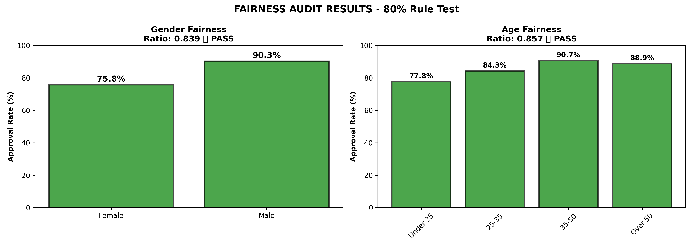
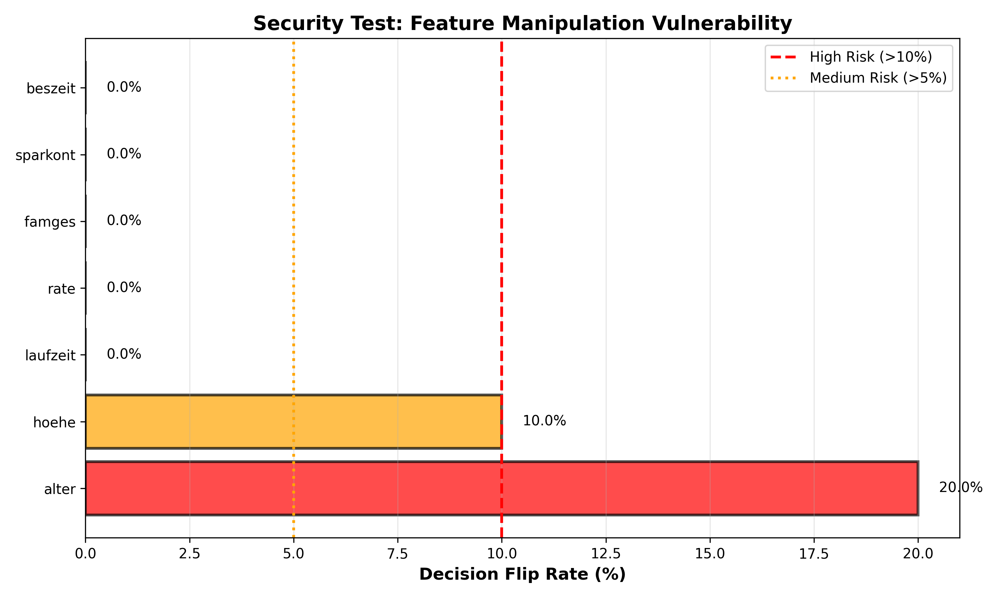
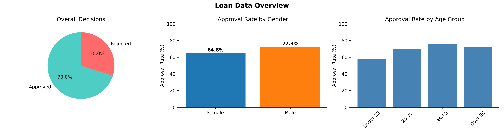

# AI Risk Management Audit - Loan Approval System

> A comprehensive fairness and security audit of an AI-powered loan approval system using the NIST AI Risk Management Framework


---

## Project Overview

This project demonstrates **professional AI auditing capabilities** by evaluating a machine learning loan approval system for:

- **Algorithmic Bias** - Testing for gender and age discrimination
- **Security Vulnerabilities** - Identifying manipulation attack vectors
- **Regulatory Compliance** - Applying the 80% Rule fairness standard

**Framework:** NIST AI Risk Management Framework (RMF) 1.0

---

## Key Findings

### Overall Risk Rating: 🟡 MEDIUM RISK

| Assessment Area | Result | Details |
|----------------|--------|---------|
| **Gender Fairness** | ✅ PASS | Disparate Impact Ratio: 0.839 (threshold: ≥0.80) |
| **Age Fairness** | ✅ PASS | Disparate Impact Ratio: 0.857 (threshold: ≥0.80) |
| **Security - Age Field** | ❌ CRITICAL | 20% manipulation success rate |
| **Security - Credit Amount** | ❌ HIGH | 10% manipulation success rate |
| **Model Accuracy** | ✅ GOOD | 73.5% prediction accuracy |

### Critical Insights

**Fairness:** Model passes legal compliance thresholds for both gender and age groups  
**Monitoring Needed:** Gender approval gap (14.5pp) operates near legal boundary  
**Security Risk:** Age field highly vulnerable to manipulation attacks  
**Business Impact:** 20% of rejected applicants could game the system

---

## Visual Results

### Fairness Analysis

*The model demonstrates legal compliance but shows disparities worth monitoring*

### Security Analysis

*Age and credit amount fields show significant manipulation vulnerabilities*

### Data Overview

*Approval rates across demographic groups*

---

## Technical Stack
```python
pandas          # Data manipulation and analysis
numpy           # Numerical computing
scikit-learn    # Machine learning (Random Forest)
matplotlib      # Data visualization
seaborn         # Statistical plotting
```

---

## Quick Start

### Prerequisites
```bash
pip install pandas numpy matplotlib seaborn scikit-learn jupyter
```

### Running the Audit
```bash
# Clone the repository
git clone https://github.com/yourusername/ai-risk-audit.git
cd ai-risk-audit

# Launch Jupyter Notebook
jupyter notebook

# Open and run AI_Fairness_Audit.ipynb
```

### Expected Output

The notebook will generate:
- 3 visualization PNG files
- Fairness metrics (80% Rule compliance)
- Security vulnerability analysis
- Risk assessment summary

---

## 📁 Project Structure
```
ai-risk-audit/
│
├── AI_Fairness_Audit.ipynb    # Main audit notebook
├── german_credit_data.csv      # Dataset (1,000 applications)
├── requirements.txt            # Python dependencies
├── README.md                   # This file
│
├── overview.png                # Generated: Data overview
├── fairness_results.png        # Generated: 80% Rule test results
└── security_results.png        # Generated: Manipulation vulnerability
```

---

## Methodology

### NIST AI RMF Framework

This audit systematically applies all four functions of the NIST framework:
```
┌─────────────┐
│   GOVERN    │ → Established audit scope and objectives
└─────────────┘
       ↓
┌─────────────┐
│     MAP     │ → Identified potential fairness and security risks
└─────────────┘
       ↓
┌─────────────┐
│   MEASURE   │ → Quantified risks using 80% Rule & perturbation testing
└─────────────┘
       ↓
┌─────────────┐
│   MANAGE    │ → Developed prioritized recommendations
└─────────────┘
```

### Testing Standards

**Fairness Testing:**
- **Metric:** Disparate Impact Ratio (80% Rule)
- **Formula:** (Protected Group Approval Rate) ÷ (Reference Group Approval Rate)
- **Threshold:** Must be ≥ 0.80 to avoid discrimination claim
- **Groups Tested:** Gender (Male/Female), Age (4 groups)

**Security Testing:**
- **Method:** Feature perturbation analysis
- **Test:** Modified each feature by 1% on rejected applications
- **Measurement:** Decision flip rate (rejection → approval)
- **Risk Levels:** >10% = HIGH, 5-10% = MEDIUM, <5% = LOW

---

## Detailed Results

### Fairness Metrics

**Gender Analysis:**
- Female approval rate: 75.8%
- Male approval rate: 90.3%
- Disparate Impact Ratio: **0.839** ✅ (passes 0.80 threshold)
- Gap: 14.5 percentage points (within legal bounds but warrants monitoring)

**Age Analysis:**
- Under-25: 77.8%
- 25-35: 84.3%
- 35-50: 90.7%
- Over-50: 88.9%
- Disparate Impact Ratio: **0.857** ✅ (passes 0.80 threshold)

### Security Vulnerabilities

**Feature Manipulation Test Results:**

| Feature | Flip Rate | Risk Level | Explanation |
|---------|-----------|------------|-------------|
| alter (age) | 20.0% | 🔴 CRITICAL | Easily falsifiable, no verification |
| hoehe (credit) | 10.0% | 🔴 HIGH | Can be strategically adjusted |
| laufzeit (duration) | 0.0% | 🟢 LOW | Stable feature |
| rate (installment) | 0.0% | 🟢 LOW | Stable feature |
| Other features | 0.0% | 🟢 LOW | No vulnerability detected |

**Attack Scenario:**
1. Applicant aged 22 gets rejected
2. Reapplies claiming age 24 (minor change)
3. 20% chance system now approves
4. No validation to detect this manipulation

---

## Key Recommendations

### Immediate Actions
1. **Implement age verification** via government ID cross-check
2. **Add input validation** to flag suspicious changes between applications
3. **Deploy rate limiting** (max 2 applications per person per 90 days)

### Short-Term
4. **Continuous monitoring dashboard** tracking approval rates by demographic
5. **Automated alerts** when fairness ratios drop below 0.85
6. **Weekly compliance reporting**

### Long-Term 
7. **Model retraining** with adversarial robustness techniques
8. **Explainability layer** (SHAP values) for transparency
9. **AI governance framework** with regular audits

---

## Real-World Context

### Why This Matters

- **73%** of organizations cite AI bias as a top concern (Gartner 2024)
- **EU AI Act** and emerging regulations require systematic AI audits
- **Financial services** face highest scrutiny for algorithmic discrimination

### Use Cases

This methodology applies to:
- Credit scoring and loan approval systems
- Hiring and recruitment AI
- Insurance underwriting algorithms
- Healthcare diagnostic tools
- Any high-stakes AI decision system

---

## References & Resources

**Standards & Frameworks:**
- [NIST AI Risk Management Framework](https://www.nist.gov/itl/ai-risk-management-framework)
- [80% Rule (Four-Fifths Rule) - EEOC Guidelines](https://www.eeoc.gov/laws/guidance/questions-and-answers-clarify-and-provide-common-interpretation-uniform-guidelines)

**Dataset:**
- [German Credit Data - UCI ML Repository](https://archive.ics.uci.edu/ml/datasets/statlog+(german+credit+data))

---
